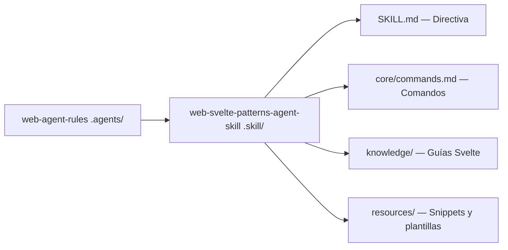

# 🧡 Svelte Patterns Agent Skill

> **Skill especializada** — Patrones arquitectónicos, auditoría y mejora de proyectos Svelte/SvelteKit.
> Skill de tipo **Especializada Web** (requiere `web-agent-rules` como base).

---

## 📌 Propósito y Alcance

1. 🔍 **Auditar** el uso de stores reactivos, SSR-safety y estructura de componentes.
2. 🛠️ **Detectar y corregir** antipatrones comunes de Svelte (estado global sin stores, acceso DOM en SSR, etc.).
3. 📐 **Validar** la arquitectura de rutas y layouts en proyectos SvelteKit.
4. 🔧 **Guiar** la migración de componentes sin tipado hacia TypeScript.
5. 📋 **Generar** reportes de deuda técnica específica del ecosistema Svelte.

---

## ⚡ $-Comandos de Svelte

| Comando | Acción | Descripción |
|---|---|---|
| `$svelte` | Bootstrap | Inicializa la skill y carga el contexto Svelte. |
| `$svelte:audit` | Auditoría | Escanea el proyecto y reporta hallazgos del dominio Svelte. |
| `$svelte:fix` | Remediación | Aplica mejoras del último `$svelte:audit`. |
| `$svelte:check` | Verificación | Identifica componentes sin tipado TypeScript. |

---

## 🧩 Arquitectura de la Skill



---

## 📦 Instalación como Submódulo

```bash
git submodule add https://github.com/xolotl-hub/web-svelte-patterns-agent-skill.git .skill/web-svelte-patterns-agent-skill
```

Activar con: `$svelte`
