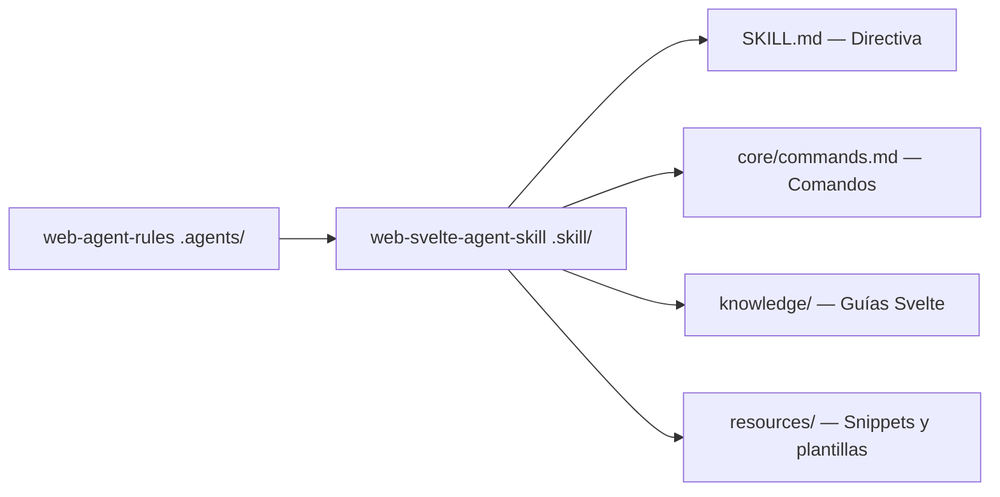

# 🧡 Svelte Agent Skill

> **Skill especializada** — Desarrollo integral, patrones arquitectónicos, auditoría y mejora de proyectos Svelte/SvelteKit (Svelte 5 Runes, SSR/SSG, Form Actions y animación).
> Skill de tipo **Especializada Web** (requiere `web-agent-rules` como base).

---

## 📌 Propósito y Alcance

1. 🔍 **Auditar** uso de Svelte 5 Runes ($state, $derived, $effect), stores reactivos, SSR-safety y estructura de componentes.
2. 🛠️ **Detectar y corregir** antipatrones comunes de Svelte (estado global mutable sin Runes/Stores, acceso DOM en SSR, etc.).
3. 📐 **Validar** la arquitectura de rutas, layouts y Form Actions en proyectos SvelteKit.
4. 🔧 **Guiar** la migración de componentes sin tipado hacia TypeScript estricto.
5. 📋 **Generar** reportes de deuda técnica específica del ecosistema Svelte.

---

## ⚡ $-Comandos de Svelte

| Comando | Acción | Descripción |
|---|---|---|
| `$svelte` | Bootstrap | Inicializa la skill y carga el contexto Svelte. |
| `$svelte:audit` | Auditoría | Escanea el proyecto y reporta hallazgos del dominio Svelte. |
| `$svelte:fix` | Remediación | Aplica mejoras del último `$svelte:audit`. |
| `$svelte:check` | Verificación | Identifica componentes sin tipado TypeScript o desalineados con Runes. |

---

## 🧩 Arquitectura de la Skill



---

## ⚡ Quick Start

**1. Instala la skill como submódulo**
```bash
git submodule add git@github.com:Agent-Rules-Ecosystem/web-svelte-agent-skill.git .skill/web-svelte-agent-skill
```

**2. Activa la skill con `$boot`**
```text
$boot
```

**3. Ejecuta el primer comando de la skill**
```text
$work agregar página de Dashboard con Svelte stores
```

---

