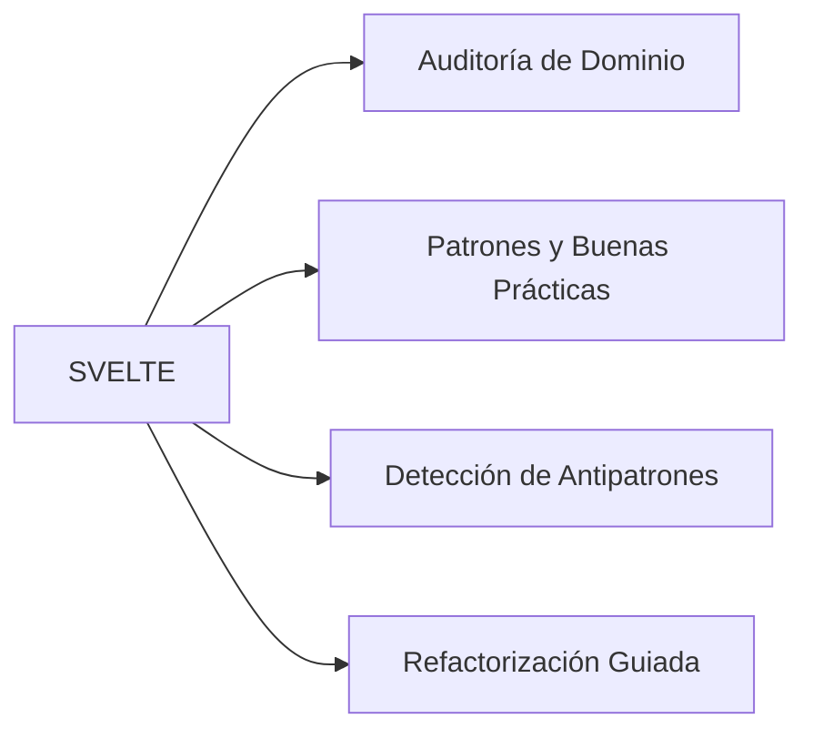

# WebSveltePatterns Skill Matrix

## Capacidades de la Habilidad



## Protocolo de Auditoría (`$svelte:audit`)

1. Detectar archivos del dominio en el proyecto
2. Evaluar cumplimiento de patrones canónicos
3. Identificar antipatrones y deuda técnica específica del dominio
4. Generar reporte de hallazgos clasificados por severidad (Alta / Media / Baja)
5. Proponer remediaciones concretas y ejecutarlas con `$svelte:fix`


---

## 📝 Persistencia y Salida Activa (`overview/work/skill/`)

Al ejecutar esta skill (mediante `$svelte` o `$svelte:audit`), es **obligatorio crear o actualizar su reporte activo** dentro del proyecto cliente en la ruta:

`overview/work/skill/web-svelte.md`

### Estructura Requerida del Reporte:

```markdown
# 📋 Registro Activo de Tareas — Web Svelte Patterns Agent Skill

> **Generado por**: `web-svelte-patterns-agent-skill` (`$svelte:audit`)  
> **Última actualización**: YYYY-MM-DD  

## 🎯 Tareas Pendientes Accionables

| ID | Tipo | Estado | Resumen | Evidencia/Ruta | Acción Requerida |
|---|---|---|---|---|---|
| SVELTE-01 | Fix / Refactor | Pendiente | <Resumen breve> | `<ruta:línea>` | <Remediación recomendada> |

## 📝 Observaciones y Detalles de Revisión
- Detalle técnico, evidencia o contexto extendido proporcionado por la revisión de la skill.
```
