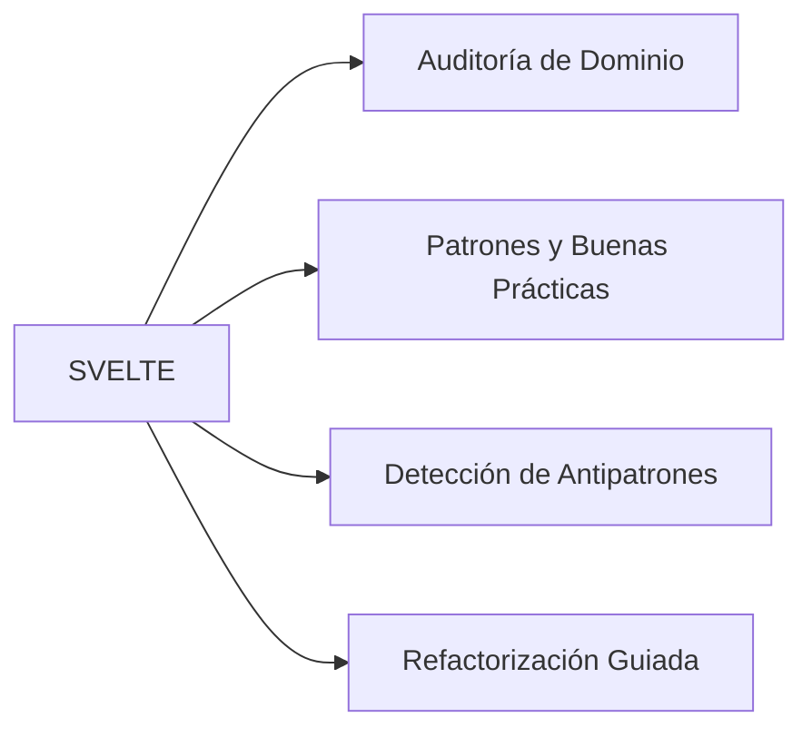

# WebSveltePatterns Skill Matrix

## Capacidades de la Habilidad

## Protocolo de Auditoría (`$svelte:audit`)

1. Detectar archivos del dominio en el proyecto
2. Evaluar cumplimiento de patrones canónicos
3. Identificar antipatrones y deuda técnica específica del dominio
4. Generar reporte de hallazgos clasificados por severidad (Alta / Media / Baja)
5. Proponer remediaciones concretas y ejecutarlas con `$svelte:fix`
