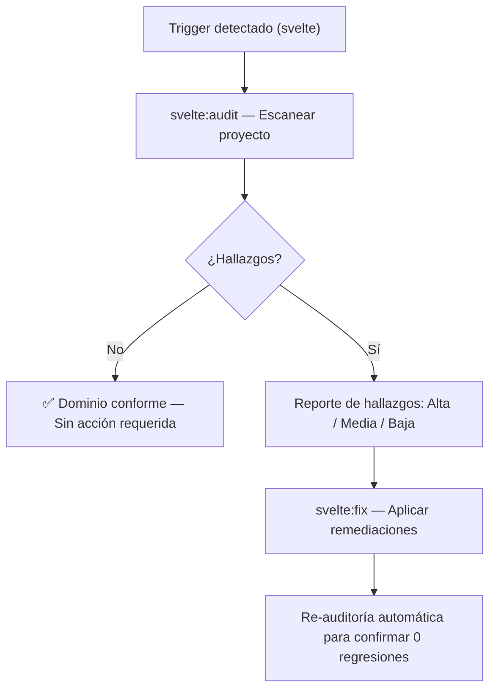

# Motor de Decisiones — Svelte/SvelteKit

## Flujo de Operación

## Matriz de Decisión

| Situación detectada | Acción del agente |
|---|---|
| Antipatrón crítico del dominio | Reportar como Alta prioridad y proponer fix inmediato |
| Violación de convenciones de nombre | Reportar como Media prioridad |
| Oportunidad de mejora opcional | Reportar como Baja prioridad |
| Dominio no aplicable al proyecto | Omitir y notificar al usuario |

## Criterio de Re-auditoría

Después de ejecutar `$svelte:fix`, re-ejecutar `$svelte:audit` automáticamente para verificar que:
- Los hallazgos de Alta prioridad fueron resueltos.
- No se introdujeron nuevas violaciones al aplicar el fix.
